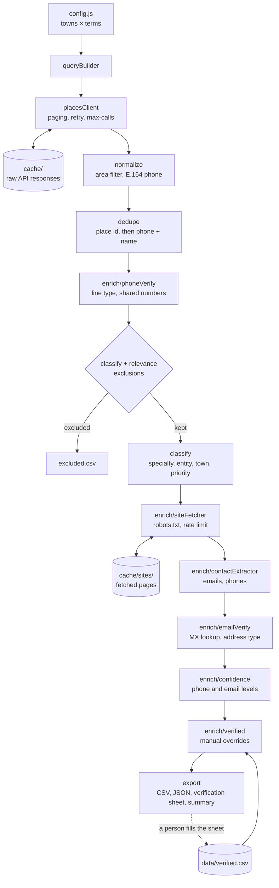

# doctor-leads

[](https://github.com/somil14/doctor-leads/actions/workflows/test.yml)
[](LICENSE)


A Node.js CLI that builds a list of publicly listed doctors, clinics and
hospitals for a set of towns, then checks and scores how far each phone number
and email can be trusted.

Towns, search terms and area rules are plain config, so it can be pointed at any
Indian city or district. This README uses Bangalore (Bengaluru, Karnataka) as
its reference example.

## Contents

- [What it does](#what-it-does)
- [Responsible use](#responsible-use)
- [Quick start](#quick-start)
- [Usage](#usage)
- [npm scripts](#npm-scripts)
- [Configuration](#configuration)
- [Output](#output)
- [Verifying contacts](#verifying-contacts)
- [Architecture](#architecture)
- [Cost](#cost)
- [Testing](#testing)
- [Contributing](#contributing)
- [Releases](#releases)
- [License](#license)

## What it does

1. **Collects listings** from the official Google Places API (New) Text Search
   endpoint, one query per town × search term.
2. **Cleans them**: keeps operational places inside the target area, normalises
   phones, merges duplicates, and removes pharmacies, labs, vets and listings
   that are not medical at all.
3. **Classifies** each lead by specialty, entity type, town and outreach
   priority.
4. **Enriches** contacts from each practice's own website (the one linked from
   its Google listing): published emails and phone numbers.
5. **Scores** every phone and email as `verified`, `high`, `medium` or `low`.
6. **Supports manual verification**: it writes a sheet for a person to fill in
   while calling practices, and applies those confirmed values on every run.

What it deliberately does not do:

- It does not read Justdial, Practo, Facebook or any other directory or
  platform.
- It does not guess or generate email addresses.
- It does not contact mail servers or send anything to anyone.

## Responsible use

This tool handles contact details of real people. If you use it, you are
responsible for how.

- **Only published data.** Everything collected was published by the practice
  itself, on its Google listing or its own website.
- **Consent for email.** A published address is not permission to send marketing.
  The verification workflow records consent; use it.
- **Follow the law where you operate**, including India's Digital Personal Data
  Protection Act and rules on unsolicited commercial communication.
- **Follow Google's terms.** The Google Maps Platform terms limit how Places
  content may be stored and used. Read them before keeping data long term:
  https://cloud.google.com/maps-platform/terms
- **Never commit collected data.** `cache/`, `output/` and `data/` are
  git-ignored for this reason. Pull requests containing real contact details
  will be closed.

## Quick start

Requires Node.js 20 or newer and a Google Cloud API key with **Places API (New)**
enabled and billing active.

```sh
git clone https://github.com/somil14/doctor-leads.git
cd doctor-leads
npm install
cp .env.example .env        # put your key in .env
# set your towns and area rules in src/config.js (see Configuration)
npm run dry-run             # see what a run would cost; no API calls
node src/index.js --towns Koramangala --terms pediatrician --max-calls 3
```

`.env`:

```
GOOGLE_PLACES_API_KEY=your-key-here
```

In the Cloud Console, restrict the key to Places API (New) and set a daily
quota.

## Usage

```sh
node src/index.js [options]
```

| Flag | Meaning |
| --- | --- |
| `--dry-run` | Print the query count and estimated maximum API calls, then exit. Needs no key |
| `--towns <list>` | Comma-separated subset of the towns in `src/config.js` |
| `--terms <list>` | Comma-separated subset of the search terms in `src/config.js` |
| `--max-calls <N>` | Stop sending API requests after N. `0` uses the cache only |
| `--skip-sites` | Do not fetch practice websites |
| `-h`, `--help` | Show usage |

Examples:

```sh
# Full run: every town × every term
node src/index.js

# Two towns, two specialties
node src/index.js --towns "Koramangala,Indiranagar" --terms "pediatrician,gynecologist"

# Cap spending at 50 API requests; finished pages stay cached
node src/index.js --max-calls 50

# Rebuild the output from cache after editing rules or data/verified.csv
node src/index.js --max-calls 0

# Cost estimate for one town
node src/index.js --dry-run --towns Jayanagar
```

Run `npm link` to install the `doctor-leads` command globally. The tool reads
`.env` and `data/`, and writes `cache/` and `output/`, relative to the directory
it is run from.

## npm scripts

| Script | Runs | Purpose |
| --- | --- | --- |
| `npm start` | `node src/index.js` | Full run. Pass flags after `--`, e.g. `npm start -- --towns Koramangala` |
| `npm run dry-run` | `node src/index.js --dry-run` | Cost estimate, no API calls |
| `npm run reprocess` | `node src/index.js --max-calls 0` | Rebuild output from cache, no API spend |
| `npm test` | `node --test` | Unit tests |
| `npm run test:watch` | `node --test --watch` | Re-run tests on change |
| `npm run clean` | removes `output/` | Clear generated results |
| `npm run clean:sites` | removes `cache/sites/` | Force practice websites to be re-read |

There is no script that deletes `cache/` itself: those files are paid-for API
responses. Delete the folder by hand when you want fresh data.

## Configuration

Everything lives in [`src/config.js`](src/config.js) and is validated at startup.

| Setting | Meaning |
| --- | --- |
| `towns` | Towns to search |
| `state` | Appended to every query: `"<term> in <town>, <state>"` |
| `searchTerms` | Terms to search in each town |
| `allowedDistricts` | An address naming one of these is inside the target area |
| `townAliases` | Alternate spellings Google uses, e.g. `Malleshwaram` → `Malleswaram` |
| `allowedPinPrefixes` | An address with no district name still passes if it names a listed town and its PIN starts with one of these |
| `verifiedFile` | Path of the manually verified contacts file |
| `api.*` | Endpoint, field mask, page size, pages per query, concurrency, retry and timeout settings |
| `sites.*` | User agent, pages per site, concurrency, delay, timeout and the list of hosts never fetched |

To target an area, set `towns`, `state`, `allowedDistricts`, `townAliases` and
`allowedPinPrefixes`. For Bangalore:

```js
towns: ["Koramangala", "Indiranagar", "Jayanagar", "Whitefield", "Malleshwaram"],
state: "Karnataka",
allowedDistricts: ["Bengaluru", "Bangalore"],
townAliases: { Malleshwaram: ["Malleswaram"] },
allowedPinPrefixes: ["560"],
```

With this config a query reads `"pediatrician in Koramangala, Karnataka"`, and a
place is kept when its address says Bengaluru or Bangalore, or names one of the
listed localities with a PIN starting 560. The names passed to `--towns` must
match entries in `towns`.

## Output

Written to `./output/`:

| File | Contents |
| --- | --- |
| `doctors_<YYYYMMDD>.csv` / `.json` | The leads, sorted by priority then review count |
| `verification_sheet_<YYYYMMDD>.csv` | The same leads laid out for manual confirmation |
| `excluded_<YYYYMMDD>.csv` | Everything left out, with a `reason` |

Exclusion reasons: `pharmacy`, `diagnostic_lab`, `veterinary`, `not_medical`,
`not_operational`, `outside_allowed_districts`, `verified_remove`.

### Lead columns

| Column | Meaning |
| --- | --- |
| `id`, `name`, `address`, `website`, `rating`, `reviewCount`, `lat`, `lng`, `mapsUrl` | From the Google listing |
| `entityType` | `individual_doctor` if the name starts with Dr., else `clinic_or_hospital` |
| `specialty` | GP/Physician, Pediatrics, Gynecology, Orthopedics, ENT, Dermatology, Diabetology, Cardiology, Chest, Dental, Hospital/Nursing Home or Unknown |
| `town` | Matched against the towns list in the address |
| `priority` | A: GP/Physician, Pediatrics or Gynecology with 20+ reviews. B: 5+ reviews. C: the rest |
| `matchedQueries`, `fetchedAt` | Which searches returned the place, and when |
| `phone` | E.164 (`+91XXXXXXXXXX`) |
| `isMobile`, `phoneType` | `mobile`, `landline`, `toll_free`, `other` or `invalid` |
| `phoneSource` | `google`, `google+website` (both agree), `website` (Google had none) or `verified` |
| `phoneSharedWith` | Other listings carrying the same number. Above 0 it is probably a reception line |
| `phoneConfidence` | `verified`, `high`, `medium` or `low` |
| `altPhones` | Other numbers on the practice's website, or a number a person replaced |
| `email` | Best published address; blank when none was found |
| `emailType` | `named` (contains the lead's name), `role` (info@, reception@) or `other` |
| `emailSource` | The page the address was found on, or `verified` |
| `emailConfidence` | `verified`, `high`, `medium` or `low` |
| `altEmails` | Other addresses found |
| `verifiedAt`, `consent` | From `data/verified.csv` |

### Confidence levels

Phone:

| Level | Meaning |
| --- | --- |
| `verified` | A person confirmed it |
| `high` | The Google listing and the practice's own website show the same number |
| `medium` | One source only, not shared with another listing, and the listing has 5+ reviews |
| `low` | Shared with another listing, the website shows different numbers, the listing has under 5 reviews, or the number is not in a valid range |

Email:

| Level | Meaning |
| --- | --- |
| `verified` | A person confirmed it |
| `high` | Published on the practice's own site, the domain accepts mail, and the address is on the site's own domain or contains the lead's name |
| `medium` | Published on the practice's own site and the domain accepts mail, but nothing ties the address to this lead |
| `low` | The website is shared by several listings, or the mail-server lookup failed |

An address whose domain has no mail server is dropped. No mailbox is probed, so
even `high` means "published and deliverable-looking", not "this doctor reads
it". Specialty is a keyword heuristic, not verified data.

## Verifying contacts

Most small-town practices publish no email, and a Google listing often carries a
reception number. The reliable fix is to ask.

1. Open `output/verification_sheet_<date>.csv`. Leads are in priority order, with
   the phone and email found so far and how far to trust them.
2. Call or message the practice and fill in the right-hand columns:

   | Column | Fill in |
   | --- | --- |
   | `phone` | The correct number, if different from `foundPhone` |
   | `email` | The address the doctor gives you |
   | `consent` | `yes` if they agreed to be contacted there |
   | `status` | `confirmed` (found phone is right), `wrong_number`, or `remove` (not a doctor, closed, duplicate) |
   | `verifiedAt` | Date of the call |
   | `notes` | Anything useful |

3. Save the sheet as `data/verified.csv`. See
   [`data/verified.example.csv`](data/verified.example.csv) for the format.
4. Run `npm run reprocess`.

Verified values override everything collected automatically and are applied on
every run. Each new sheet already contains the earlier verified rows, so saving
it over `data/verified.csv` loses nothing. Untouched rows are ignored.

## Architecture

### Pipeline



### Modules

| Module | Responsibility |
| --- | --- |
| `src/config.js` | Towns, terms, area rules, API and website settings; validates config and env |
| `src/queryBuilder.js` | Towns × terms query matrix; resolves `--towns` / `--terms` |
| `src/placesClient.js` | Text Search requests: pagination, backoff with jitter, call budget, stale page-token recovery |
| `src/cache.js` | One JSON file per API request, keyed by `sha1(query + pageToken)` |
| `src/normalize.js` | Status and area filter, phone normalisation, town extraction |
| `src/dedupe.js` | Merge by place id, then by phone when the names also match |
| `src/classify.js` | Specialty, pharmacy/lab/vet exclusion, entity type, priority |
| `src/enrich/relevance.js` | Drops listings that are not medical |
| `src/enrich/phoneVerify.js` | Line type from the numbering plan; shared-number detection |
| `src/enrich/siteFetcher.js` | robots.txt-aware, rate-limited, cached fetcher for practice websites |
| `src/enrich/contactExtractor.js` | Emails and phones from HTML; filters placeholders and vendor addresses |
| `src/enrich/emailVerify.js` | MX lookup and address typing |
| `src/enrich/confidence.js` | Confidence level for each phone and email |
| `src/enrich/verified.js` | Reads `data/verified.csv`, applies overrides, builds the verification sheet |
| `src/enrich/index.js` | Orchestrates enrichment across leads |
| `src/export.js` | CSV and JSON writers, console summary |
| `src/index.js` | CLI entry point; wires the pipeline together |

### Design decisions

- **Pure functions, thin edges.** Filtering, dedupe, classification, extraction
  and scoring are pure and unit-tested. Only `placesClient`, `siteFetcher`,
  `emailVerify` and `export` touch the network or disk, and each takes its I/O
  function as a parameter so tests never hit the network.
- **Cache first.** Every API response and every web page is stored before it is
  used. Changing a rule and re-running costs nothing.
- **Precision over recall.** When evidence is weak the tool lowers confidence or
  leaves a field blank rather than filling it with a guess.
- **A shared phone is not a duplicate.** A hospital and the doctors who sit
  there often list the same number. They stay separate leads and the number is
  flagged.
- **Humans override machines.** `data/verified.csv` always wins, so manual work
  is never lost on a re-run.
- **Own websites only.** A practice's own site is evidence about that practice.
  Shared platforms are never fetched.

### Repository layout

```
src/                 application code (see Modules)
  enrich/            contact enrichment and verification
test/                node:test unit tests, one file per area
data/                verified.csv lives here (git-ignored); example file is tracked
cache/               raw API responses and fetched pages (git-ignored)
output/              generated results (git-ignored)
.github/workflows/   CI
```

## Cost

- Each query follows `nextPageToken` for up to 3 pages (60 results), so the
  maximum is `towns × terms × 3` requests. Five Bangalore localities × 15 terms
  is 75 queries and at most 225 requests. Dense city areas usually fill all
  three pages; small towns often return one.
- The field mask includes phone, website and rating fields, which places every
  request in the **Text Search Enterprise** SKU. Check the current price and free
  allowance before a full run:
  https://developers.google.com/maps/billing-and-pricing/pricing
- A cached page is never requested again. Retried requests (429/5xx) count as
  calls and count toward `--max-calls`.
- Website lookups and mail-domain checks cost nothing.
- Set a budget alert and a per-day quota on the API as a backstop.

## Testing

```sh
npm test
```

Tests use the built-in `node:test` runner with no extra dependencies. Network
and DNS are stubbed; the tests make no external requests and need no API key.
CI runs them on Node 20 and 22 for every push and pull request.

## Contributing

Contributions are welcome. [`CONTRIBUTING.md`](CONTRIBUTING.md) has the short
checklist; the full rules and process are below.

### Rules

1. **No real data in the repository.** No API keys, and no real names, phone
   numbers, emails or files from `cache/`, `output/` or `data/`. Use invented
   values in tests (`Dr. A Kumar`, `+919876543210`, `example.org`).
2. **No new data sources without discussion.** Open an issue first. Sources that
   forbid automated access, or that expose data people did not publish
   themselves, will not be accepted.
3. **No address guessing.** Features that generate or infer contact details are
   out of scope.
4. **Tests are required.** New behaviour needs a test; a bug fix needs a test
   that fails without the fix.
5. **Keep I/O at the edges.** New logic should be a pure function. Anything that
   touches the network or disk must accept its I/O function as a parameter.
6. **Plain JavaScript.** ESM, Node 20+, no TypeScript, no build step. Every
   exported function has a JSDoc block.
7. **Few dependencies.** Prefer the standard library. Justify any new package in
   the pull request.
8. **Respect the sites.** Do not weaken robots.txt handling, the page limit, the
   delay or the skip list.

### Process

1. **Open an issue** describing the bug or proposal, unless the change is
   trivial. Wait for a maintainer to agree on the approach for anything larger
   than a small fix.
2. **Fork and branch** from `main`. Name the branch `feat/<topic>`,
   `fix/<topic>` or `docs/<topic>`.
3. **Make the change** with tests. Run `npm test`.
4. **Commit** using [Conventional Commits](https://www.conventionalcommits.org/):
   `feat: …`, `fix: …`, `docs: …`, `test: …`, `refactor: …`, `chore: …`. One
   logical change per commit.
5. **Update docs.** Change the README if flags, columns, config or behaviour
   changed, and add a line under `[Unreleased]` in `CHANGELOG.md`.
6. **Open a pull request** against `main` and fill in the template. CI must
   pass.
7. **Review.** A maintainer reviews; address comments with new commits rather
   than force-pushing. Pull requests are squash-merged.

### Reporting problems

- **Bugs and ideas:** open an issue with the command you ran, what happened and
  what you expected. Remove real contact details from anything you paste.
- **Security issues or an exposed key:** do not open a public issue. Use
  GitHub's private vulnerability reporting on this repository.

## Releases

The project follows [Semantic Versioning](https://semver.org/):

- **Patch** (`1.0.x`): bug fixes and rule tweaks that do not change columns or
  flags.
- **Minor** (`1.x.0`): new flags, columns, config settings or data sources.
- **Major** (`x.0.0`): removed or renamed flags or columns, or a change to the
  format of `data/verified.csv`.

To cut a release, a maintainer moves the `[Unreleased]` entries in
`CHANGELOG.md` under a new version heading, bumps `version` in `package.json`,
tags the commit `vX.Y.Z` and publishes a GitHub release with those notes.

History is in [`CHANGELOG.md`](CHANGELOG.md).

## License

[MIT](LICENSE)
